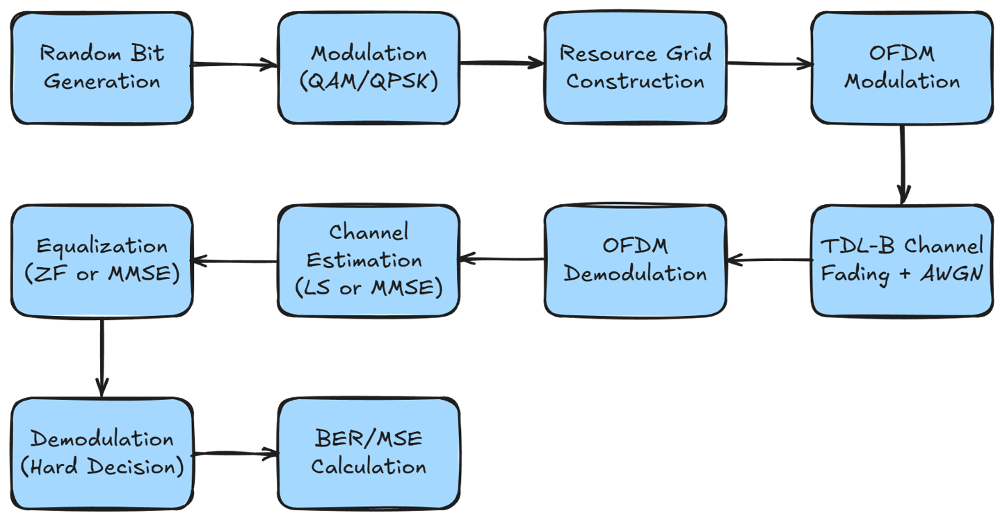

# Mini project
### 5G PUSCH Resource Grid with Channel estimation and equalization

This repository contains MATLAB code for simulating the 5G NR Physical Uplink Shared Channel (PUSCH) resource grid, including channel estimation, equalization and performance evaluation under realistic fading channel conditions.

## Overview

The simulation models the transmission and reception of data over a 5G PUSCH resource grid with these specifications: 
| Parameter                | Description                                   |
|--------------------------|-----------------------------------------------|
| Size                     | 3276 × 14                                     |
| Number of symbols        | 170352                                        |
| DMRS                     | 3rd column (index 2, zero-based) |
| Modulation schemes       | QPSK, 16QAM, 64QAM                            |
| Time domain (after OFDM) | 61440 samples                                 |
| Channel                  | TDLB-100-25                                   |
| SNR (dB)                 | [0, 30]                                        |
| Channel estimation       | LS, MMSE                                      |
| Channel equalization     | ZF, MMSE                                      |
| Evaluation metrics       | MSE, BER                                      |

## Basic flow



## Algorithms

### Channel Estimation and Equalization
- **LS (Least Squares)**: Estimates the channel by dividing received DMRS by transmitted DMRS and linearly interpolating.
- **MMSE (Minimum Mean Square Error)**: Uses channel statistics and noise variance for optimal estimation and balances channel inversion and noise suppression for optimal recovery.
- **ZF (Zero Forcing)**: Inverts the channel estimate to remove distortion, ignoring noise.

### Modulation
- **QPSK, 16QAM, 64QAM**: Maps bits to constellation points using Gray coding for error minimization.

### Channel Model
- **TDL-B**: Simulates realistic multipath fading with specified tap delays and powers.

## Usage
1. Run `main_lszf.m` for LS+ZF simulation, or `main_mmse.m` for MMSE simulation (comparing with LS+ZF), or run `main_mod.m` for different modulation scheme with channel estimation and equalization methods:
   ```matlab
   main_lszf
   % or
   main_mmse
   % or 
   main_mod
   ```
2. Results (BER, MSE) will be plotted for various SNR values.

## Requirements
- MATLAB R2018b or later.
